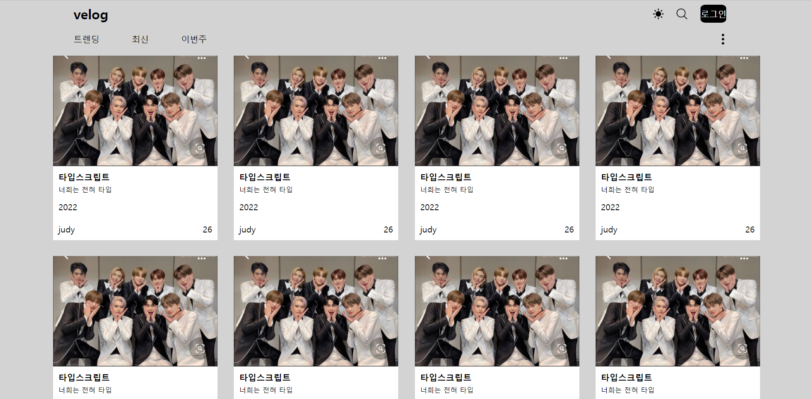
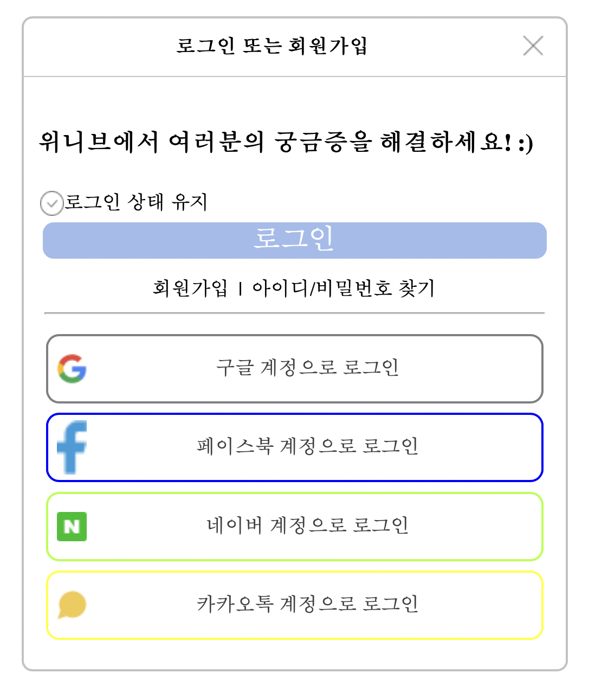

# pair-coding-00
중소커톤 pair-coding group 0

영권 선영
민규 상민 진우 하린 수은 주현

   

## Velog
---

  

 

* __팀원__

    * 수은
      _html 이름 지으면서 힘들어하기,  8개 만든거 후회하기_
      https://github.com/LikeLion-at-CAU-10th/Sueun-Lee  

    * 주현
      _사진 경로 이상해서 시간 날리기, 8개 하나 하나 class 수정하기_
      https://github.com/Jeudi-judy/Juhyeon-Byun.git  

    * 진우 
      _너무 여유롭게 진행해서 JS 건드리지 못한거 아쉬움, HTML 뼈대구성 시간 너무 오래걸림_  
      https://jinu-u-kim.github.io/portfolio_1/  

    * 민규 
                                      
      https://cadenzza1.github.io/  

  💕🥲😶‍🌫️🎶
